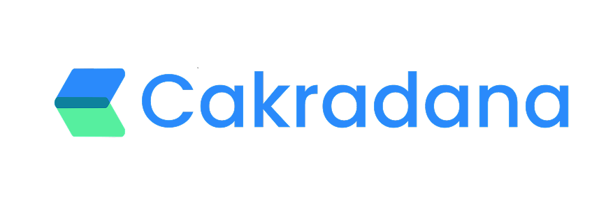

# 🏛️ Cakradana Web

<div align="center">



> **Empowering Clean & Transparent Elections with AI-Powered AML Detection**

[](https://nextjs.org/)
[](https://reactjs.org/)
[](https://www.typescriptlang.org/)
[](https://tailwindcss.com/)

</div>

Cakradana is an innovative web application that enhances election financing transparency by monitoring donations from individuals, corporations, and political parties in real-time, detecting money laundering with AI, and providing comprehensive donation network visualization.

## 🌟 What is Cakradana?

Cakradana is a comprehensive election campaign finance monitoring platform designed to ensure transparency and integrity in political funding. The platform leverages artificial intelligence to detect suspicious donation patterns and provides real-time monitoring of campaign contributions.

### Key Features

- 🔍 **Real-Time Donation Monitoring** - Track every campaign donation flow instantly from various sources
- 📊 **Interactive Analytics Dashboard** - Visualize donor-recipient relationships and generate comprehensive campaign financial reports
- 🤖 **AI-Powered Anomaly Detection** - Identify suspicious donation patterns like smurfing or illegal transactions using advanced machine learning algorithms
- 🔗 **Multi-Source Data Integration** - Support for paper donation forms (OCR), digital forms, and web scraping for anomaly detection
- ✅ **Donation Verification & Confirmation** - Candidates/recipients can confirm or report suspicious transactions through dedicated dashboards

## 🚀 What does cakradana-web do?

The `cakradana-web` repository contains the frontend web application that provides:

### Public Features
- **Landing Page** - Showcases Cakradana's capabilities and features
- **User Authentication** - Secure login, registration, and password management
- **Feature Demonstrations** - Interactive showcases of AI detection and analytics

### Dashboard Features (Protected)
- **Real-time Donation Tracking** - Monitor incoming donations with risk assessment
- **Analytics & Reporting** - Interactive charts and financial reports
- **Risk Analysis** - AI-powered suspicious transaction detection
- **Network Visualization** - Donor-recipient relationship mapping
- **Document Upload** - Support for paper and digital donation forms
- **User Management** - Role-based access control for different user types

### User Types Supported
- 🏠 **Individual** - Personal donors
- 🏢 **Corporation** - Corporate donors
- 🏛️ **Organization** - Non-profit organizations
- 🎯 **Political Party** - Political party representatives
- 🏛️ **Government** - Government entities
- 📋 **Other** - Other donor types

## 🛠️ Tech Stack

### Frontend Framework
- **[Next.js 15.4.2](https://nextjs.org/)** - React framework with App Router
- **[React 18.3.1](https://reactjs.org/)** - UI library
- **[TypeScript 5.0](https://www.typescriptlang.org/)** - Type safety

### Styling & UI
- **[Tailwind CSS 3.4.17](https://tailwindcss.com/)** - Utility-first CSS framework
- **[Radix UI](https://www.radix-ui.com/)** - Accessible UI primitives
- **[Lucide React](https://lucide.dev/)** - Beautiful icons
- **[React Icons](https://react-icons.github.io/react-icons/)** - Icon library
- **[GSAP](https://greensock.com/gsap/)** - Advanced animations

### Forms & Validation
- **[React Hook Form](https://react-hook-form.com/)** - Performant forms
- **[Yup](https://github.com/jquense/yup)** - Schema validation
- **[@hookform/resolvers](https://github.com/react-hook-form/resolvers)** - Form validation resolvers

### Data Visualization
- **[Chart.js](https://www.chartjs.org/)** - Interactive charts
- **[D3.js](https://d3js.org/)** - Data visualization library
- **[Recharts](https://recharts.org/)** - React chart library

### Development Tools
- **[ESLint](https://eslint.org/)** - Code linting
- **[PostCSS](https://postcss.org/)** - CSS processing
- **[Autoprefixer](https://autoprefixer.github.io/)** - CSS vendor prefixes

## 📁 Project Structure

```
src/
├── app/                    # Next.js App Router pages
│   ├── dashboard/         # Protected dashboard pages
│   ├── login/            # Authentication pages
│   ├── signup/           # Registration pages
│   └── layout.tsx        # Root layout
├── components/           # Reusable React components
│   ├── ui/              # Base UI components
│   ├── DashboardLayout.tsx
│   ├── ProtectedRoute.tsx
│   └── PublicRoute.tsx
├── lib/                 # Utility functions and hooks
│   ├── auth-context.tsx # Authentication context
│   ├── auth-service.ts  # API service layer
│   └── utils.ts         # Helper functions
└── public/              # Static assets
```

## 🚀 Getting Started

### Prerequisites
- Node.js 18+ 
- npm or yarn

### Installation

1. **Clone the repository**
   ```bash
   git clone https://github.com/cakradana-app/cakradana-web.git
   cd cakradana-web
   ```

2. **Install dependencies**
   ```bash
   npm install
   # or
   yarn install
   ```

3. **Run the development server**
   ```bash
   npm run dev
   # or
   yarn dev
   ```

4. **Open your browser**
   Navigate to [http://localhost:3000](http://localhost:3000)

### Available Scripts

- `npm run dev` - Start development server
- `npm run build` - Build for production
- `npm run start` - Start production server
- `npm run lint` - Run ESLint

## 🔗 Related Links

- **🌐 Website**: [https://cakradana.org](https://cakradana.org)
- **📚 API Documentation**: [https://api.cakradana.org](https://api.cakradana.org)

## 🤝 Contributing

We welcome contributions! Please see our contributing guidelines for more details.

1. Fork the repository
2. Create a feature branch (`git checkout -b feature/amazing-feature`)
3. Commit your changes (`git commit -m 'Add some amazing feature'`)
4. Push to the branch (`git push origin feature/amazing-feature`)
5. Open a Pull Request

## 🙏 Acknowledgments

- Built with ❤️ for transparent and fair elections
- Powered by advanced AI and machine learning technologies
- Designed for the Indonesian electoral system

---

**Cakradana** - Empowering democracy through transparency and technology.
